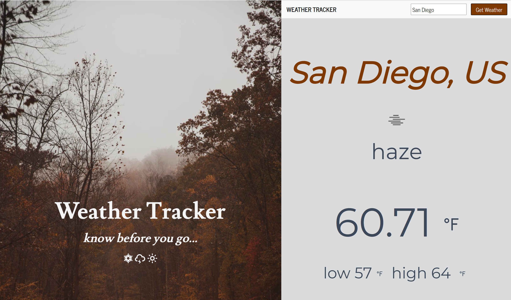

# weather-dashboard

## Description

Technologies & Languages

- JavaScript
- React
- Open Weather API
- React Hooks
- React Bootstrap
- React Icons
- React Styled Components

This weather tracker application allows the user to enter any city and view the cities current weather conditions and temperatures. Open Weather API makes a call to the weather database and retrieves current weather data.

## Table of Contents

- [Video](#video)
- [Installation](#installation)
- [Usage](#usage)
- [Credits](#credits)
- [License](#license)
- [Questions](#questions)

## Video

## Installation

Steps to install my project include:

- npm install the dependencies

## Usage

- When you first arrive to the application you will see a search bar. Type in any city and see the current weather data for that city with the Open Weather API.

## Credits

All of the code was developed by Dana Kuglin. Information about her GitHub profile and how you can contact her are listed below in the questions section.

## License

This project is licensed under MIT.

## Questions

GitHub Username: dakuglin
GitHub Profile: (https://github.com/dakuglin)

Please email me with additional questions at dakuglin@gmail.com
